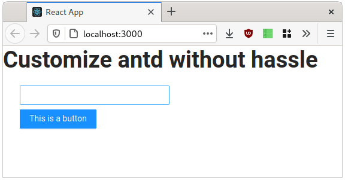
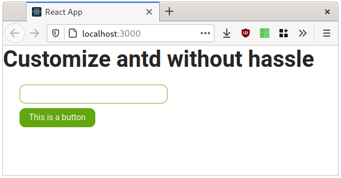

# Customizing antd without craco or ejecting
(or: how to use Less CSS with create-react-app (but really, stick to cra defaults))

> **Note**: Using create-react-app@4? While this guide works, there's a slightly
> simpler one available [here](https://github.com/tommie-lie/cra-antd-customization/tree/cra%404).

There are many guides showing how to customize antd in a create-react-app
out there, but so far I have not found any that go without using craco,
react-app-rewired or similar solutions to mess with cra's default config.

This guide will show you how to customize antd without adding any dependencies
besides less-loader while completely staying in the bounds that create-react-app
provides.

## Table of Contents
* [tl;dr](#tldr)
* [Intro](#intro)
  * [The Good](#the-good)
  * [The Bad](#the-bad)
  * [The Ugly](#the-ugly)
* [Background: Of Webpack Loaders](#background-of-webpack-loaders)
* [(There Must be)a Better Way](#there-must-be-a-better-way)
  * [Using Less in create-react-app](#using-less-in-create-react-app)
  * [Overriding antd Theme Configuration](#overriding-antd-theme-configuration)
  * [Improvements on the Bundle Structure](#improvements-on-the-bundle-structure)


## tl;dr
1. Install `less-loader`
   ```shell
   npm install --save less-loader less
   ```
2. Replace your `antd(.min).css` import a nwith the following line:
   ```javascript
   import "./customized-antd.css";
   ```
3. Create a file called `customized-antd.css` with the following content:
   ```css
   @import "./antd-overrides.css!=!less-loader?{\"lessOptions\":{\"javascriptEnabled\":true}}!antd-overrides.less";
   ```
4. Create a file called `antd-overrides.less` with the following content:
   ```less
   @import "~antd/lib/style/themes/default.less";
   @import "~antd/dist/antd.less";
   
   // set Less variables here like this:
   @primary-color: #61a70e;
   @border-radius-base: 10px;
   ```

## Intro

While antd provides a sound design system to start off, there comes a time
when you may want to change the visual design, maybe just to switch colors.

If you use create-react-app (cra for short) to build your React app, you
are faced with the question whether to use one of the many guides and
solutions to meddle with cra intenrals, or completely eject from cra just
to change antd's color scheme.

There is a third option and this guide will show how to customize antd
when using cra
* without flaky packages that break on every other major version of cra
* no bogus post-processing that breaks my hot-reloading
* full compatibility with the rest of cra

### The Good
The "convention over configuration" aproach of
[create-react-app](https://create-react-app.dev) saves a lot
of time. It helps developers to get started very fast without spending much
time on their toolchain and for most use-cases, batteries are included.
But using third party libraries that do not follow the convention may
become quite frustrating.

### The Bad
A popular and very comprehensive UI component framework is
[antd](https://ant.design). It consists of many well-designed components to
use in more complex React-based software and also allows for quite some
[customizations](https://ant.design/docs/react/customize-theme)
to its visual design.

However, it is using Less CSS for styling and customization is done by
modifying Less variables, either in an imported `.less` file or by setting
them in the Less pre-processor.

Either way, we have to interpret Less in order to customize antd.

### The Ugly
While cra readily supports Sass/SCSS right out of the box, there is no way
to use Less in cra. While there is an
[unmerged pull request](https://github.com/facebook/create-react-app/pull/10494),
it may well be several months before we see Less support in cra.

Because of this,
[many](https://ant.design/docs/react/use-with-create-react-app#Customize-Theme)
[different](https://blog.bitsrc.io/510a3344ef5d)
[ways](https://medium.com/@aksteps/782c53cbc03b)
have evolved to use Less in cra, each with their own drawbacks.

All those solutions have one thing in common:

> Stuff can break <br/>
> - [Dan Abramov](https://twitter.com/dan_abramov/status/1045809734069170176)


## Background: Of Webpack Loaders and Asset Modules
In cra, webpack is used to convert all your source files to a working
application. Besides bundling together all the JavaScript files it also
processes them for minification, browser-compatibility and other stuff.
Those transformations are done by webpack using loaders which are hooked
into `import` statements. They are the reason why you can do the following
and get your CSS classnames as globally unique identifiers:
```javascript
import styles from "./somefile.css";
```

As all imports go through a chain of loaders, many approaches
get Less working with cra by modifying the internal webpack configuration
of cra to process `.less` files with the `less-loader`.
As this configuration is not intended by cra to be changed, all
existing solutions based on craco or similar tools use some sort of
configuration merging by hooking into cra internals. They bring their
own plugin ecosystem that may interfere with normal cra operations
and may even break with a minor cra update.

In webpack, we can get around using a custom configuration file
by using a special [inline syntax](https://webpack.js.org/concepts/loaders/#inline)
to configure loaders.
This syntax is not very useful as a replacement for the configuration file
in the general case, hence it is not recommended, but it is still officially
supported and very useful now that we want to use a loader without
touching the configuration.

As of version 5 of webpack, there is another mechanism,
[Asset Modules](https://webpack.js.org/guides/asset-modules/) which partially
replaces but also partially interferes with the regular loader mechanism.
As described in the configuration, Asset Modules allow for including auxiliary
files without a specific loader, either by referencing a filename or by directly
inlining the file. In cra@5, all resources that are *not* directly supported by cra,
i.e. a file with the extension `.less` is forced to be a `asset/resource` module,
which causes only the filename/url to be imported instead of the while file. While
this is useful when embedding images or audio files in `` or `<audio>` elements,
this is not what we want with stylesheets.
 

## (There Must be) a Better Way
Let's start with a plain cra app and add some antd:
```sh
$ npm init react-app@4 cra-antd-customization
$ npm install --save antd
```
The straightforward way to include antd's styles into your app is to use
the already precompiled stylesheet that antd distributes:
```javascript
import "antd/dist/antd.min.css";
```
With this line at the top of your `App.js` or `index.js` you can use any antd
component without further ado and it will look like this:


### Using Less in create-react-app

But we are importing a plain `.css` file. No processing necessary, but no design
customization possible. We first need something that can understand
Less, and since we want to make use of all the webpack glory, we will
use `less-loader`:
```sh
$ npm install --save less-loader less
```
The
[antd less configuration site](https://ant.design/docs/react/customize-theme#Customize-in-webpack)
tells us how to use this loader:
* we need to chain it through `style-loader`, `css-loader` and finally
`less-loader`
* and we have to activate the `javascriptEnabled` option

Normally, we could just use webpack's inline syntax to configure this loader chain
and use `?` to pass options to the less-loader: 

```javascript
// this won't work with cra@5
import "!style-loader!css-loader!less-loader?{\"lessOptions\":{\"javascriptEnabled\":true}}!antd/dist/antd.less";
```

In this chain it would be style-loader's responsibility to take a stylesheet and
apply it to the DOM's `<head>` element accordingly.
However, as cra@5's config only yields filenames for `.less` files, style-loader
won't get a complete stylesheet that it can apply to the DOM but only a filename,
it doesn't really know what to do.

Where can we put a *filename* to a stylesheet then?
We can put it in an `@import` clause in *another* stylesheet and import this one
from our `App.js`

So let's create a new file, called `customized-antd.css` and add the following line:
```css
/* still not really there, yet */
@import "!css-loader!less-loader?{\"lessOptions\":{\"javascriptEnabled\":true}}!antd/dist/antd.less";
```
What happened to `style-loader`? Well, it imports styles *as JavaScript*.
Since we are not in a JavaScript file, we don't need it, we only want to import
CSS here.

But this does not work either, because webpack processes *all* imports, even
those in CSS files, and instead importing the stylesheet that is generated by
less-loader, the import is literally replaced by the filename (without `@import`
in front of it). A file containing just a filename is not a valid CSS stylesheet
and importing it won't do anything useful.

Luckily, there is another handy webpack import syntax, the
[inline matchResource](https://webpack.js.org/api/loaders/#inline-matchresource)
syntax. It tells webpack to import something **as if** it had a different
name. And we can use this syntax to import the `.less` file **as if** it was
a CSS file. And webpack/cra@5's config knows how to handle CSS files!

Combining this syntax with our inline configuration for less-loader, we can
write:
```css
@import "antd.less.css!=!less-loader?{\"lessOptions\":{\"javascriptEnabled\":true}}!antd/dist/antd.less";
```
What happened to all the other loaders? Well, for one, `style-loader` is
really not useful in a CSS file, because it generates JavaScript to import a
stylesheet into the DOM and we can't process that JavaScript inside a CSS file.
Then there's the "as if" syntax which tells webpack to use all the standard
loaders associated with a CSS file which, unsurprisingly, contains css-loader.

We can then just `import "customized-antd.css";` in our `App.js` and finally
we can, with a little indirection, import `.less` files into a cra App!

### Overriding antd Theme Configuration

The inline loader syntax, while being non-obvious, is quite easily explained
and you only have to copy it into your code once.
The syntax for loader parameters, however, is quite cumbersome with all the
`\"`s and the object notation for each and every variable.
If you want to do some heavy modification, this quickly becomes
unmaintainable in a single line if you use the `modifyVars` parameter
as suggested by antd's documentation.

Instead of configuring all overrides in the loader configuration, we can
also just write our own `.less` file and set the variables there.

So let's create a `override-antd.less` file like this:
```less
@import "~antd/lib/style/themes/default.less";
@import "~antd/dist/antd.less";

@primary-color: #61a70e;
@border-radius-base: 10px;
```
and then back in our `customized-antd.css` file, change the filename
for the import:
```css
@import "override-antd.less.css!=!less-loader?{\"lessOptions\":{\"javascriptEnabled\":true}}!./override-antd.less";
```
This way we have a single file where we can override all the Less variables
we want and can make antd look like this:



I'd still recommend using SCSS if you want to introduce your own styles
because this is the way cra promotes.
